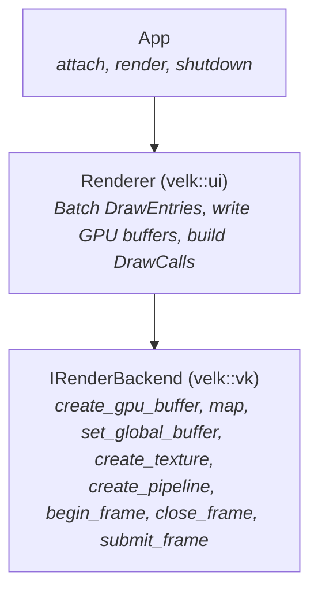
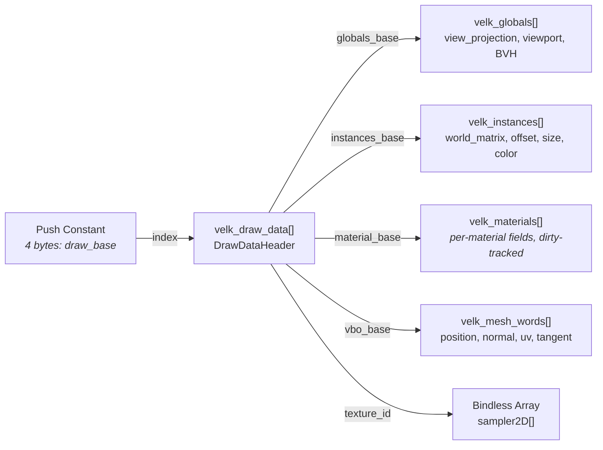
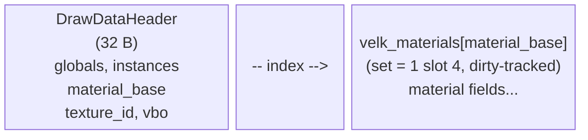
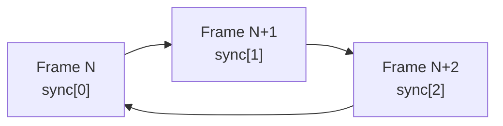

# Velk Render Backend Architecture

A bindless GPU rendering abstraction that maps directly to how modern GPUs work, rather than abstracting over graphics API concepts. For frame lifecycle (prepare/present split, threading, multi-rate rendering), see [Rendering](rendering.md).

The archicture was inspired by [No Graphics API](https://www.sebastianaaltonen.com/blog/no-graphics-api) essay by Sebastian Aaltonen. It argues that modern GPU hardware (coherent caches, buffer device addresses, bindless descriptors) has converged enough that the traditional graphics API abstraction layer can be replaced by something much simpler. Velk has no legacy codepath to maintain, so why not try something different (and hopefully simpler).

## Contents
- [Bindless?](#bindless)
- [The Core Idea](#the-core-idea)
- [Architecture Overview](#architecture-overview)
- [IRenderBackend interface](#irenderbackend-interface)
  - [Concepts the interface does not expose](#concepts-the-interface-does-not-expose)
- [The DrawCall](#the-drawcall)
- [Data Flow: How Pixels Get Drawn](#data-flow-how-pixels-get-drawn)
  - [The GPU resource model](#the-gpu-resource-model)
    - [Why indices rather than device addresses](#why-indices-rather-than-device-addresses)
  - [Per-frame staging buffer](#per-frame-staging-buffer)
  - [The DrawDataHeader](#the-drawdataheader)
  - [Instance data](#instance-data)
  - [Shader includes](#shader-includes)
- [Geometry Without Geometry Objects](#geometry-without-geometry-objects)
  - [2D UI: Unit quad + vertex pulling](#2d-ui-unit-quad--vertex-pulling)
  - [3D meshes: Vertex pulling](#3d-meshes-vertex-pulling)
- [Materials: Per-material GPU Data](#materials-per-material-gpu-data)
- [Textures: Bindless by Default](#textures-bindless-by-default)
- [Technical Details](#technical-details)
  - [Value structs in GLSL](#value-structs-in-glsl)
  - [std430 alignment and the DrawDataHeader](#std430-alignment-and-the-drawdataheader)
  - [Color space](#color-space)
  - [Frame synchronization](#frame-synchronization)
  - [Dynamic rendering](#dynamic-rendering)
- [Extension points](#extension-points)
- [Vulkan Implementation Details](#vulkan-implementation-details)
- [Future: Metal Backend](#future-metal-backend)


## Bindless?

"Bindless" traditionally refers to accessing GPU resources (textures, buffers) by address or index rather than binding them to fixed slots before each draw call. Velk's render backend takes this approach across the board:

  * **Bindless textures**: all textures live in a global array, accessed by index. One descriptor set bind per frame, zero per draw call.
  * **Bindless buffers**: shader data is reached without per-draw descriptor binds. Every record the GPU reads (the draw header itself, frame globals, per-instance arrays, material params, scene lights, BVH nodes/shapes, RT primary shapes, mesh instances / static data / BLAS runs, mesh vertex + index words, glyph curve tables) lives in one of sixteen **`set = 1` storage buffers read by integer index**. **No shader in the engine dereferences a GPU pointer**: there is no `buffer_reference` in any shader source. See [The GPU resource model](#the-gpu-resource-model).
  * **No descriptor set switching per draw**: each draw call receives one 4-byte push constant, the element index of its `DrawDataHeader` in the draw-data arena. From that record the shader reaches globals / instances / material / vertex streams, all by index.
  * **No vertex buffer binding**: there are no VAOs, vertex attribute descriptions or `vkCmdBindVertexBuffers`. Pipelines have empty vertex input state. 2D geometry is procedural (unit quads expanded in the vertex shader), 3D geometry uses vertex pulling from a shared mesh-word arena.
  * **Persistent, dirty-gated data**: per-draw data is written into persistently mapped GPU memory, so per-frame allocations, staging copies and command-buffer transfers are not needed. Each producer (batch, material, view, mesh primitive, font) owns a **stable region** of a shared arena and rewrites it only when its contents change; a steady-state frame uploads almost nothing. The one thing still written per frame is the small indirect-command blob each batch owns.

Per draw call, the CPU issues a `vkCmdPushConstants` and a `vkCmdDraw*IndirectCount`, and nothing else: no descriptor binds, no vertex buffer binds, no uniform updates. On the GPU side, reaching the draw record is a single indexed load from an L2-cached storage buffer, comparable to a traditional uniform buffer read.

However, this is *not* GPU-driven rendering (yet). The CPU still decides what to draw and builds the draw call list. Draws are issued through indirect-count commands (`vkCmdDraw*IndirectCount`), but the CPU writes the draw count and argument records; the GPU does not yet perform culling or sorting. The indirect substrate is in place so a future GPU-driven path can write those buffers instead. The "bindless" label describes the resource access model: once data is in GPU memory, shaders reach it by index into a permanently bound slot, not through per-draw API binding.

## The Core Idea

Traditional render backends abstract over graphics APIs. They expose concepts like vertex input layouts, uniform buffers, descriptor sets, and pipeline state objects. These concepts exist because GPU hardware used to be diverse: some GPUs had fixed-function vertex fetch, others needed explicit descriptor management, and resource binding models varied wildly.

Modern GPUs have converged. Every current GPU supports:

- **Large bound storage buffers**: shaders read arbitrary structs out of them by index
- **Bindless descriptors**: textures accessed by index from a global array
- **Coherent caches**: CPU writes to mapped GPU memory are visible to shaders
- **Programmable vertex fetch**: shaders can read vertex data from arbitrary buffers

Where all GPUs support these features, the translating abstraction is not needed. Instead of mapping between "uniform buffers", "push constants" and "constant buffers", write a struct into a shared buffer and give the shader its element index:
* Instead of managing descriptor sets, you give the shader a texture index.
* Instead of describing vertex layouts, the shader reads what it needs from a buffer.

Where the essay reaches for buffer device addresses as the mechanism, velk reaches for an index into a bound buffer: the same base + offset at the same cost, minus the raw pointer. See [Why indices rather than device addresses](#why-indices-rather-than-device-addresses).

## Architecture Overview

The system has three layers:



| Layer | Task |
|--|--|
| App | Calls `render()` each frame. It never touches GPU resources directly. |
| Renderer | Pulls scene state, groups draw entries by pipeline, writes instance data and draw headers into a mapped GPU buffer, and produces an array of `DrawCall` structs.<br>Current `ClassId::Renderer` implementation lives in velk-ui for the UI framework use cases. There could also be other IRenderer implementations optimized more e.g. for 3D. |
| Backend | manages resources and executes draw calls. It owns the swapchain, synchronization, and all GPU objects. The renderer talks to it through IRenderbackend.<br>Several backend implementations can exist for different graphics APIs (e.g. Vulkan, D3D12 or Metal) |

## IRenderBackend interface

The following methods from `IRenderBackend` give the renderer everything it needs to put pixels on screen.

| Category | Methods |
|--|--|
| Lifecycle | `init`, `shutdown`, `wait_idle` |
| Surfaces | `create_surface`, `destroy_surface`, `resize_surface`, `recreate_surface`, `acquire_swapchain_texture` |
| GPU memory | `create_gpu_buffer`, `record_buffer_update`, `defer_destroy_gpu_buffer` |
| Textures | `create_texture`, `upload_texture`, `read_texture`, `create_depth_attachment_texture`, `defer_destroy_gpu_texture` |
| Render target groups | `create_render_target_group`, `defer_destroy_gpu_render_target_group` |
| Pipelines | `create_pipeline_dynamic`, `create_compute_pipeline`, `defer_destroy_gpu_pipeline` |
| Frame lifecycle | `begin_frame`, `create_command_buffer`, `execute`, `blit_to_texture`, `barrier`, `close_frame`, `submit_frame` |

**Memory** is the foundation:
* `create_gpu_buffer`: Allocate a GPU buffer (`GpuBufferDesc` sets size, CPU-writable flag, index-buffer usage). Returns an `IGpuBuffer::Ptr`. Buffers are reached by the shader as a bound `set = 1` slot plus an element index, not by device address.
* `record_buffer_update`: Inline `vkCmdUpdateBuffer`-style write for small (<64 KB) device-local updates.
* `defer_destroy_gpu_buffer`: Queue a buffer for destruction after the in-flight frame's GPU completion marker resolves.

This is the single mechanism for getting all data to the GPU: frame globals, instance data, vertex data, index data, material parameters. Above it, `IGpuArena` suballocates one such buffer into stable per-producer regions; see [The GPU resource model](#the-gpu-resource-model).

**Textures** are bindless by design:
* `create_texture`: Create a texture from a `TextureDesc` (dimensions, format, and usage: Sampled / RenderTarget / Storage / ColorAttachment). Returns an `IGpuTexture::Ptr`; the texture's bindless `TextureId` (a `uint32_t` index into the global sampled-texture array) is reachable via the `IGpuTexture` interface.
* `upload_texture`: Upload pixel data via a staging buffer; fills mip 0 and generates the rest via blit-downsampling.
* `read_texture`: GPU → CPU readback (for screenshots, golden-image tests).
* `create_depth_attachment_texture`: Convenience for the depth side of dynamic-rendering passes.
* `defer_destroy_gpu_texture`: Queue a texture for destruction after the in-flight frame completes.

The texture id can be used in any shader and any draw call. The backend manages the descriptor array internally.

**Render target groups** bundle N color attachments + an optional depth into one allocation unit. Used by the deferred G-buffer path: producers ask the group for its color/depth `IGpuTexture*`s and pass them straight into `record_begin_rendering`. The group is a producer-side wrapper, not a backend concept; there is no group-aware `begin_pass` overload.

**Pipelines** link shaders plus rasterizer state. Pipelines are compiled against dynamic-rendering attachment formats, never against an explicit render pass:

* `create_pipeline_dynamic`: Creates a graphics pipeline from a `PipelineDesc` (vertex + fragment `IShader::Ptr`s plus a `PipelineOptions` struct carrying topology, cull mode, front-face, blend mode, depth test / write), an array of color attachment formats (1 entry for forward, N for MRT), and a depth attachment format. The pipeline is built with `VkPipelineRenderingCreateInfo`; producers record `vkCmdBeginRendering` against attachments matching those formats.
* `create_compute_pipeline`: Creates a compute pipeline from a `ComputePipelineDesc` (compute shader only).
* `defer_destroy_gpu_pipeline`: Queue a pipeline for destruction.

The shader itself defines what data it reads and how (everything is available through memory buffers), so the pipeline never describes vertex input layouts, uniform bindings, or resource layouts.

Above the backend, `IRenderContext` provides a higher-level API that separates shader compilation from pipeline creation:

* `compile_shader(source, stage, key = 0)`: Compiles GLSL source to an `IShader::Ptr` handle that owns the compiled bytecode. Consults an on-disk SPIR-V cache before falling back to the compiler, which is reached through `IShaderCompiler` and implemented by the `velk_glsl` plugin; see [Materials → Shader cache](materials.md#shader-cache). Built-in shaders pass a `constexpr make_hash64(source)` as the cache key; leaving `key` as 0 hashes the source at runtime.
* `compile_pipeline_dynamic(frag_src, vert_src, key, color_formats, depth_format, options, cache_group = nullptr)`: Compiles GLSL sources, links them, and registers the resulting pipeline in the context's cache under a `PipelineCacheKey{user_key, target_format, target_group}`. Producers call this lazily on first cache miss against the active path's attachment formats.
* `create_compute_pipeline(compute_shader, key)` / `compile_compute_pipeline(source, key)`: Compute equivalents.

The UI renderer registers default vertex and fragment shaders during setup. This means materials typically only need to provide a fragment shader.

**Frame lifecycle.** A frame is a `begin_frame` → `close_frame` → `submit_frame` sequence. The split lets all command recording happen on one thread (where the renderer runs `prepare`) while the GPU submit + present run on another (where it runs `present`); see [rendering](rendering.md). The backend has no `begin_pass` / `end_pass` calls: producers record their own `vkCmdBeginRendering` / `vkCmdEndRendering` inside cached secondary command buffers via `IGpuCommandBuffer`.

* `begin_frame`: Waits on the GPU fence for the slot being reused, then starts primary command buffer recording. Runs on the recording thread.
* `acquire_swapchain_texture(surface_id)`: Returns the per-surface composite as a stable `IRenderTarget::Ptr`. Producers render into the composite as if it were any `IGpuTexture`; the backend emits the final composite-to-swap blit at present time (in `submit_frame`). Wrapper is stable across frames; the swapchain image rotation is hidden inside the backend.
* `create_command_buffer`: Allocates an `IGpuCommandBuffer` (Vulkan secondary) that producers record once (draws / dispatches / texture blits / `record_begin_rendering`+`record_end_rendering`) and the executor replays each frame. One overload; no target argument is needed for dynamic-rendering secondaries.
* `execute`: Replays a recorded command buffer (`vkCmdExecuteCommands` on the primary).
* `blit_to_texture`: Blits between two textures (used internally by `IGpuCommandBuffer::record_blit_to_texture` for cacheable texture-to-texture copies).
* `barrier`: Inserts a pipeline barrier between passes. Call when a pass reads output the previous one wrote.
* `close_frame`: Finalizes the frame on the recording thread. Snapshots the present target (composite image + swapchain) so the swap-image acquire and present can run on the submit thread without touching shared surface state. The primary is left open for `submit_frame` to finish.
* `submit_frame`: Acquires the swap image, records and runs the composite-to-swap blit, ends the primary, submits to the GPU queue, and presents. Swapchain acquire and present both happen here so the swapchain is only ever used from one thread.

The backend handles command buffer recording, synchronization, and image layout transitions internally; the renderer only speaks passes, dispatches, and barriers.

### Concepts the interface does not expose

Several things a graphics API abstraction usually exposes have no entry point here. Each is either handled inside the backend or unnecessary given the data model:

| Concept | Where it is handled |
|--|--|
| Vertex input descriptions | Pipelines are created with empty vertex input state; shaders read vertices by index from the mesh-word arena. |
| Descriptor set layouts, pipeline layout objects | One fixed layout for every pipeline: set 0 for bindless images, set 1 for the sixteen arena slots, plus a 128-byte push-constant range. |
| Per-resource layout transitions | Derived inside the backend from the pass targets and baked into the recorded secondary. |
| Semaphores and fences | Owned by the backend. Frame completion is a timeline semaphore; see [Frame synchronization](#frame-synchronization). |
| Uniform reflection | Not used for binding. `ShaderMaterial` reflects SPIR-V, but to discover parameter names and offsets, not to bind resources. |

## The DrawCall

```cpp
/// Always dispatched indirectly: the actual draw count is read from
/// `count_buffer` at GPU execution time, so a future GPU-side culling
/// pass can write the count (and records) without CPU involvement.
struct DrawCall
{
    IGpuPipeline* pipeline{};   ///< Which pipeline to bind.
    bool indexed{false};        ///< true => indexed draw (uses `index_buffer`).

    IGpuBuffer* index_buffer{};       ///< Index buffer. Required when `indexed`.
    uint64_t index_buffer_offset{};   ///< Byte offset into `index_buffer`.

    IGpuBuffer* args_buffer{};        ///< Buffer holding indirect-draw records.
    uint64_t args_buffer_offset{};    ///< Byte offset of the first record.
    uint32_t args_stride{};           ///< Bytes per record (5xu32 indexed, 4xu32 non-indexed).

    IGpuBuffer* count_buffer{};       ///< Buffer holding the uint32 actual draw count.
    uint64_t count_buffer_offset{};   ///< Byte offset of the count value.
    uint32_t max_draw_count{1};       ///< Upper bound: min(count_buffer[0], max_draw_count) draws.

    /// Push constant data. For a raster draw this is a single uint32:
    /// the element index of this draw's DrawDataHeader.
    uint8_t  root_constants[kMaxRootConstantsSize]{};
    uint32_t root_constants_size{}; ///< Bytes used in root_constants.
};
```

The backend always dispatches indirectly: `vkCmdDrawIndexedIndirectCount` when `indexed` (binding the IBO at `index_buffer_offset`), otherwise `vkCmdDrawIndirectCount`. The draw count comes from `count_buffer` and the per-draw arguments from `args_buffer`. Today the CPU writes a count of 1 and a single record per batch; the indirection is the substrate a future GPU-driven path (compute culling writing the count + records) plugs into without changing the call shape or the CPU/GPU data contract. 3D mesh primitives use the indexed path; the TriangleStrip unit quad and fullscreen effects use the non-indexed path.

The `root_constants` field carries up to `kMaxRootConstantsSize` (128) bytes that get pushed directly to the shader via push constants (Vulkan) or `setBytes` (Metal). 128 is Vulkan's spec-guaranteed minimum, so any conformant driver works.

A raster draw uses 4 of those bytes: the element index of its `DrawDataHeader`. The rest of the space is what lets more elaborate dispatches push their whole per-dispatch state inline: the RT path's `RtRoot` (64 bytes of indices, counts and inline params) is pushed directly rather than living in a buffer.

## Data Flow: How Pixels Get Drawn

### The GPU resource model

Everything the GPU reads lives in a **shared arena**: one large buffer bound to a fixed `set = 1` slot, suballocated into regions. A producer (a batch, a material, a view, a mesh primitive, a font) holds an `ArenaRegion` (a move-only RAII handle over a byte range) and publishes an **element index** derived from its region offset. Shaders read `velk_<thing>.data[base + i]`.

```
set = 1 slot   Arena                       Held by
────────────   ─────────────────────────   ─────────────────────────────
 0 / 1         TLAS BVH nodes / shapes     SceneBvh
 2             per-view FrameGlobals       ViewPreparer, render-target cache
 3             per-batch instance runs     each batch
 4             material records            each material
 5             per-view light arrays       ViewPreparer
 6             RT primary shape list       ViewPreparer
 7 / 8 / 9     glyph curves / bands / table each font (velk_text plugin)
10             per-shape mesh instances    SceneBvh, ViewPreparer
11 / 12 / 13   mesh static / BLAS nodes / tris   each IMeshPrimitive
14             mesh VBO + IBO words        each IMeshBuffer
15             per-batch DrawDataHeader    each batch
```

Three properties make this work:

- **Regions are stable.** A producer allocates once and rewrites in place. Bases can therefore be *baked* into cached secondary command buffers, which is what the persistent-pass model requires; a rotating per-frame allocation would go stale on any frame the command buffer is replayed rather than re-recorded.
- **Frees are fence-deferred.** `~ArenaRegion` hands the range back as a zombie tagged with the current frame's completion marker; the byte free-list reclaims it only once the backend reports that frame complete. An in-flight GPU read can never see its bytes reassigned.
- **Writes are change-gated.** Producers rewrite a region only when their source data actually changes. In the bistro scene this took the per-frame upload sweep from 3.35 ms to 0.09 ms.

Arenas come from `IGpuResourceManager::create_arena` / `shared_arena(slot, element_size)`; the backing allocation is an ordinary `IGpuBuffer` from `create_gpu_buffer`, so a Metal or WebGPU backend supplies its own with no arena changes. Growth doubles and recopies, and re-binds the one frame-invariant descriptor for that slot.

#### Why indices rather than device addresses

A shader could reach the same bytes through a 64-bit buffer device address. Velk indexes instead, for four reasons:

- **It matches how velk reaches everything else.** Objects live in paged hives and are reached by handle, never by raw pointer, so that allocations can move and churn without invalidating references. An index into a bound buffer is that same discipline on the GPU side; an address graph would be the one place the engine contradicts its own model.
- **It costs nothing.** `velk_globals.data[base]` and a pointer dereference both compile to base + offset off a register. The choice is about which base the hardware gets handed, not about how much work it does.
- **It ports.** WebGPU has no buffer device addresses and no proposal for one. Raw addresses cannot be bounds-checked inside the web sandbox, so they are structurally excluded rather than merely missing. Indices are core there, and on Metal, and on Vulkan.
- **It survives relocation.** An arena that grows replaces its backing allocation. Every address into the old one would be stale; an element base is unchanged, because it was never tied to where the buffer happens to live.

The cost is that the shader can only reach data the CPU has bound to a slot, so anything a shader must reach has to live in one of the sixteen arenas. In exchange, every GPU reference is a small integer that means something in isolation, and out-of-range reads land inside a known buffer instead of anywhere in memory.

Nothing in the engine can produce an address: `bufferDeviceAddress` is not enabled, buffers carry no `SHADER_DEVICE_ADDRESS` usage, and `IGpuBuffer` has no `gpu_address()`. A buffer the GPU consumes wholesale (indirect args, an index buffer) is bound by handle and has no shader-visible reference at all, so `get_gpu_ref` answers `None` for it.

### Per-frame staging buffer

One bump-allocated staging buffer per in-flight frame slot (persistently mapped, 1 MB initial, growing on demand) serves a single purpose: the indirect-draw commands of batches that have no persistent storage buffer of their own, such as the environment batch. Everything else a draw needs is in an arena region.

Each batch that does have storage owns a 48-byte blob, `[args(32)][count(16)]`: the `VkDrawIndexedIndirectCommand` record plus the draw count. That is exactly what still has to be a buffer the GPU reads in its own right, because `vkCmdDrawIndexedIndirectCount` takes buffer handles, not indices.

### The DrawDataHeader

The `DrawDataHeader` is the root of the shader's data graph. The push constant carries its element index, and from that record the shader reaches everything else:



Every field is an index or a count, and the C++ struct and the GLSL struct mirror each other exactly:

```cpp
// C++ (velk-render/gpu_data.h)

VELK_GPU_STRUCT DrawDataHeader
{
    uint32_t globals_base;       ///< index into velk_globals[] (set = 1 slot 2)
    uint32_t instances_base;     ///< element base into velk_instances[] (slot 3)
    uint32_t texture_id;         ///< bindless index, 0 = none
    uint32_t instance_count;
    uint32_t vbo_base;           ///< word base of the vertex stream in velk_mesh_words[] (slot 14)
    uint32_t uv1_base;           ///< word base of the TEXCOORD_1 stream, or of a single-vertex fallback
    uint32_t uv1_enabled;        ///< 0 = fallback (vertex 0 only), 1 = per-vertex
    uint32_t material_base;      ///< element base into velk_materials[] (slot 4)
};
static_assert(sizeof(DrawDataHeader) == 32, ...);
```

```glsl
// GLSL: velk.glsl declares `struct VelkDrawData` and the slot-15 buffer once.
// A shader declares its push constant and names the handle.

VELK_DRAW_DATA(root)
```

`VELK_DRAW_DATA(Name)` expands to `layout(push_constant, std430) uniform VelkPC { uint draw_base; } Name;`, so `root` is the push-constant block itself and `velk_draw(root)` is this draw's record. Shader bodies name neither: every field is reached through an accessor that takes the handle, so the header's layout can change without touching a shader body.

| Accessor | Reads |
|--|--|
| `velk_global_data(root)` | `velk_globals.data[…globals_base]` |
| `velk_instance(root)` | `velk_instances.data[…instances_base + gl_InstanceIndex]` |
| `velk_material(root)` | `velk_materials.data[…material_base]` |
| `velk_vertex3d(root)` | 12 words at `…vbo_base + gl_VertexIndex * 12` in `velk_mesh_words` |
| `velk_uv1(root)` | 2 words at `…uv1_base`, with `uv1_enabled` as a branchless index multiplier |
| `velk_draw(root)` | the raw record, for the two fields with no accessor (`texture_id`, `material_base`) |

The accessors require only that their argument has a `draw_base` member, not that it is the push-constant block. That is deliberate: a GPU-driven path that selects a record per draw (from `gl_DrawID`, say) can pass a local struct instead, and every shader body keeps working.

Eval-based fragment shaders reach the material record through `VELK_LOAD_MATERIAL` instead (see [Materials](materials.md)).

### Instance data

`instances_base` in the header is an element index into the shared instance arena (set = 1 slot 3), a Renderer-owned persistent storage buffer where every batch suballocates a stable region for its instances. The shader reads its draw's instance via `velk_instance(root)`. Instances are `ElementInstance` structs, the universal per-instance record: every visual (rect, rounded rect, text glyph, texture, image, env, cube, sphere, future glTF meshes) packs this one layout, so there's only one GLSL instance type to learn and one vertex shader pattern that handles everything.

```cpp
// C++ (velk-scene/instance_types.h)

VELK_GPU_STRUCT ElementInstance
{
    mat4     world_matrix;  ///< 64 B, filled by batch_builder per instance.
    vec4     offset;        ///< 16 B, xyz = local offset (glyph pos for text, 0 otherwise).
    vec4     size;          ///< 16 B, xyz = extents (size.z = 0 for 2D visuals).
    color    col;           ///< 16 B, visual tint.
    uint32_t params[4];     ///< 16 B, params[0] = shape_param (glyph index, ...); others reserved.
};
static_assert(sizeof(ElementInstance) == 128, ...);
```

```glsl
// GLSL (provided by velk-ui.glsl)

struct ElementInstance {
    mat4  world_matrix;
    vec4  offset;
    vec4  size;
    vec4  color;
    uvec4 params;
};

// velk-ui.glsl binds the shared instance arena as ElementInstance:
VELK_INSTANCES(ElementInstance)   // -> set = 1 slot 3, read via velk_instance(root)
```

Visuals pack their instances via `DrawEntry::set_instance()`:

```cpp
ElementInstance inst{};
inst.offset = {0.f, 0.f, 0.f, 0.f};
inst.size   = {bounds.width, bounds.height, 0.f, 0.f};  // size.z = 0 → 2D visual
inst.col    = state->color;
entry.set_instance(inst);
```

2D visuals leave `size.z = 0` and `offset = 0`; text glyphs set per-glyph `offset` and `params[0] = glyph_index`; 3D primitives fill all three xyz extents in `size`. The `world_matrix` slot is left zero-initialised by the visual; the batch builder writes the element's transform into it when concatenating instances into the batch's arena region.

Material parameters use the same authoring pattern: a C++ struct (`VELK_GPU_STRUCT`) mirrors the GLSL layout and is written via `write_draw_data()`. See [Materials](./materials.md) for the full authoring story.

### Shader includes

The shader compiler resolves `#include` directives against built-in virtual include files. Two are provided; a full reference for what each one exports lives in [Materials → Shader includes](materials.md#shader-includes).

| Include | Source | Provides |
|--|--|--|
| `velk.glsl` | velk-render (always available) | `VELK_DRAW_DATA(Name)` + `velk_draw(root)`, `GlobalData` / `velk_global_data(root)`, `VelkVertex3D` / `velk_vertex3d(root)` / `velk_uv1(root)`, `VELK_INSTANCES(Type)` / `velk_instance(root)`, `VELK_MATERIAL(Type)` / `velk_material(root)`, `VELK_VARYINGS_OUT` / `VELK_VARYINGS_IN`, `VELK_FRAG_OUT(Name)`, `VELK_GBUFFER_OUT`, `velk_texture(id, uv)`, BVH / RT / mesh types and their accessors |
| `velk-ui.glsl` | velk-scene (registered by the renderer on init) | `ElementInstance` (+ `VELK_INSTANCES(ElementInstance)`), `EvalContext`, `MaterialEval`, `velk_default_material_eval()` |

Modules can register additional includes via `IRenderContext::register_shader_include()`; the text plugin registers `velk_text.glsl` for glyph coverage sampling.

With these includes, a complete UI vertex shader needs one declaration token and `main()`:

```glsl
#version 450
#include "velk.glsl"
#include "velk-ui.glsl"

VELK_DRAW_DATA(root)

void main()
{
    VelkVertex3D    v    = velk_vertex3d(root);
    ElementInstance inst = velk_instance(root);

    vec4 local   = vec4(inst.offset.xyz + v.position * inst.size.xyz, 1.0);
    vec4 world_h = inst.world_matrix * local;
    gl_Position  = velk_global_data(root).view_projection * world_h;
}
```

This same shell is what the shared `element_vertex_src` runs for every visual, 2D or 3D. The only difference is what's in the bound VBO (the unit quad for 2D, a cube/sphere/glTF mesh for 3D) and whether `inst.size.z` is zero.

## Geometry Without Geometry Objects

There is no geometry API. Vertex data, index data, instance data and material data are bytes in shared GPU buffers, reached by index. The shader decides what to read.

### 2D UI: Unit quad + vertex pulling

2D visuals render against a shared unit-quad `IMesh` (4 vertices, TriangleStrip, no IBO). The mesh builder allocates it once per render context and returns the same `IMesh::Ptr` across calls; the batch builder stamps its single primitive onto any `DrawEntry` a 2D visual leaves without geometry.

The vertex shader pulls vertices from the bound VBO via `velk_vertex3d(root)` and scales them by the instance `size`:

```glsl
VelkVertex3D v = velk_vertex3d(root);
vec2 q = v.position.xy;           // (0,0), (1,0), (0,1), (1,1) on the unit quad
```

The draw call is `vertex_count = 4, instance_count = N` (non-indexed, since the unit quad is a TriangleStrip).

### 3D meshes: Vertex pulling

3D geometry lives in two interface layers (see [mesh](mesh.md) for the full authoring story):

- **`IMeshPrimitive`** is one geometry + material unit. It owns a vertex/index range into an `IMeshBuffer` plus the attribute layout, topology, and bounds.
- **`IMesh`** is a container of primitives, matching glTF's mesh.

`IMeshBuffer` holds VBO bytes followed by IBO bytes in one region of the shared mesh-word arena (`set = 1` slot 14). Multiple primitives in the same mesh commonly share one buffer (each with its own vertex/index offsets and counts) so a glTF asset imports without re-packing. The arena stores raw 32-bit words; both the raster vertex shader and the RT triangle walk read the same words, the former unpacking a `VelkVertex3D` from 12 of them.

Every `DrawEntry` produced by a 3D visual carries one `IMeshPrimitive::Ptr`. A multi-primitive visual emits one `DrawEntry` per primitive, each with its own material, and the batch builder groups them by pipeline + primitive + material into draw calls. This is the same submit path as 2D; the primitive is what locates the vertex/index words:

```cpp
IMesh*          mesh = ...;              // authored container
IMeshPrimitive* p    = mesh->get_primitives()[i].get();
IMeshBuffer*    buf  = p->get_buffer().get();

GpuRef   geometry = get_gpu_ref(buf);    // Kind::Index once resident
uint32_t vbo_base = geometry.get_base(); // word base of the VBO half
size_t   ibo_off  = buf->get_ibo_offset() + p->get_index_offset() * sizeof(uint32_t);
uint32_t count    = p->get_index_count();
```

The index buffer bound for the indexed draw is the arena's own backing buffer at the mesh's offset; `IGpuArena::buffer()` is re-asked per draw because growth replaces it.

The shader pulls vertices by index, exactly as in 2D, with no vertex input state on the pipeline. The shared `element_vertex_src` is the one vertex shader every visual runs:

```glsl
VelkVertex3D    v    = velk_vertex3d(root);
ElementInstance inst = velk_instance(root);

vec4 local   = vec4(inst.offset.xyz + v.position * inst.size.xyz, 1.0);
vec4 world_h = inst.world_matrix * local;
gl_Position  = velk_global_data(root).view_projection * world_h;
```

Adding new primitive kinds (line strips, point clouds, terrain) is a matter of topology and vertex layout; no backend changes.

## Materials: Per-material GPU Data

Materials supply a pipeline plus a per-material GPU data record that the fragment shader reads. The record lives in the Renderer-owned material arena (`set = 1` slot 4): each material suballocates a persistent region, dirty-tracked and rewritten only when its contents change. The `DrawDataHeader` carries a `material_base` index, and the fragment shader reads `velk_materials.data[material_base]`. On the CPU the material still serialises through an `IProgramDataBuffer` (for the byte-diff), whose bytes are copied into the arena region.

The relevant interfaces (`velk-render/interface/intf_draw_data.h`, `intf_material.h`):

```cpp
// IDrawData: per-draw GPU data.
virtual size_t get_draw_data_size() const = 0;
virtual ReturnValue write_draw_data(void* out, size_t size,
                                    ITextureResolver* resolver = nullptr) const = 0;

// IMaterial: eval body + vertex source.
virtual string_view get_eval_src() const = 0;
virtual string_view get_eval_fn_name() const = 0;
virtual string_view get_vertex_src() const = 0;
```

`ext::Material` provides the plumbing: derived classes override those methods and the base handles the per-material `IProgramDataBuffer` lifecycle. `write_draw_data` is invoked only when the buffer's cached bytes have gone stale; unchanged materials skip the re-upload entirely.

The result in GPU memory for one draw:



Each material defines a C++ `VELK_GPU_STRUCT` and a matching GLSL value struct, and reads it through `VELK_LOAD_MATERIAL(T, ctx)`. Both paths reach the same arena, differently:

- **Raster.** A pipeline compiles for exactly one material, so `VELK_MATERIAL(T)` binds slot 4 as a typed `T[]` and the load is a direct indexed read.
- **RT / deferred compute.** One shader serves every material type in the scene, so a typed array is impossible. The composer instead parses the snippet's struct declaration, computes its std430 offsets, validates them against SPIR-V reflection, and generates a `T velk_unpack_T(uint b)` that rebuilds the struct from the arena's raw words. It splices that in place of the snippet's `VELK_MATERIAL(T)` line and defines the load to call it.

The snippet source is identical either way. Unsupported constructs (arrays, `mat3`, preprocessor directives inside the record) fail generation loudly rather than silently dropping a field. The CPU struct size and the GLSL std430 stride must agree; see the [alignment section](#std430-alignment-and-the-drawdataheader) below, and [Materials](materials.md) for the full authoring story.

The binding is an index, and correctness rests on the C++ struct and the GLSL struct agreeing on layout. There is no uniform reflection or name-based binding in this path; `ShaderMaterial` is the one case that reflects, and it does so to discover parameters, not to bind them.

## Textures: Bindless by Default

`create_texture` returns a `TextureId` which is a `uint32_t`. This value is directly usable as an index in the shader:

```glsl
layout(set = 0, binding = 0) uniform sampler2D velk_textures[];

float alpha = texture(velk_textures[nonuniformEXT(texture_id)], uv).r;
```

The backend maintains a single global descriptor set with a variable-length sampler array (1024 slots). When a texture is created, it takes the next free slot, recycled from a free list of destroyed-texture slots or taken as the next never-used index. The slot index IS the `TextureId`. A destroyed texture's slot is returned to the free list once the GPU is past the frames that referenced it, so long-running sessions that churn textures do not exhaust the array. The descriptor set is written by the backend when a texture is created; callers pass the id around and sample with it.

On the Vulkan side, this uses descriptor indexing (core since 1.2) with `UPDATE_AFTER_BIND` and `PARTIALLY_BOUND` flags. The descriptor set is bound once per frame and never changes.

## Technical Details

### Value structs in GLSL

Every GPU record is a plain GLSL `struct` living inline in a bound buffer:

```glsl
struct ElementInstance {  // value type, 128 bytes
    mat4  world_matrix;
    vec4  offset;
    vec4  size;
    vec4  color;
    uvec4 params;
};
```

No shader declares a `buffer_reference`, so no shader source requires `GL_EXT_buffer_reference` or `GL_EXT_shader_explicit_arithmetic_types_int64`, and no GLSL declaration anywhere contains a `uint64_t`.

Two consequences when writing shaders:

- **A record's array stride must equal the C++ record size.** A mismatch misreads every element after the first, so it is worth getting right up front. `VELK_GPU_STRUCT` (`alignas(16)`) handles the C++ side, but watch std430's own rules: it derives struct alignment from the largest member, *not* by rounding up to 16 the way std140 does. When a record's largest member is smaller than a `vec4`, std430 computes a smaller stride than `alignas(16)` gives the C++ struct, and the difference has to be made up with explicit padding fields on the GLSL side.
- **Region alignment is the arena's job.** Each producer's region is aligned to its own record size so `offset / record_size` lands on an integer element index.

The RT root (`RtRoot`) is not a buffer at all: it is 64 bytes of indices, counts and inline values pushed straight into the push-constant block.

### std430 alignment and the DrawDataHeader

When writing custom materials or draw data, the CPU-side struct layout must match the shader's std430 packing. The key alignment rules:

| GLSL type | Size | Alignment |
|-----------|------|-----------|
| `uint`, `float` | 4 | 4 |
| `vec2` | 8 | 8 |
| `vec3` | 12 | 16 |
| `vec4` | 16 | 16 |
| `uvec2` | 8 | 8 |

The `DrawDataHeader` packs exactly to 32 bytes, 16-byte aligned (`VELK_GPU_STRUCT` rounds the size up to a multiple of 16). Eight `uint`s and no padding: with every field 4 bytes and the count a multiple of four, nothing needs aligning.

```cpp
VELK_GPU_STRUCT DrawDataHeader
{
    uint32_t globals_base;       // 4 bytes, offset  0
    uint32_t instances_base;     // 4 bytes, offset  4
    uint32_t texture_id;         // 4 bytes, offset  8
    uint32_t instance_count;     // 4 bytes, offset 12
    uint32_t vbo_base;           // 4 bytes, offset 16
    uint32_t uv1_base;           // 4 bytes, offset 20
    uint32_t uv1_enabled;        // 4 bytes, offset 24
    uint32_t material_base;      // 4 bytes, offset 28
};
static_assert(sizeof(DrawDataHeader) == 32, ...);
```

The material's data record lives in the `set = 1` material arena at `material_base`, not after the header. It is a std430 buffer whose element the material's C++ struct and the GLSL block must lay out identically; the shader array stride must equal the C++ record size, so custom material structs should use `VELK_GPU_STRUCT` (`alignas(16)`) so the compiler handles padding automatically and 16-byte-aligned GLSL fields never see an offset mismatch. See [Materials](materials.md) for the full authoring story.

### Color space

Producers render into per-surface RGBA16F composite intermediates and the backend blits to the swapchain at present time, so the swap format is largely invisible to producers. Forward / deferred pipelines compile against `RGBA16F` (HDR-capable); a tonemap post-process step (opt-in) maps to LDR before the present blit. UI-only scenes without post-process treat colors as sRGB throughout: JSON scene files, C++ color structs, and shader output are all in the same space.

If you need strict linear-space rendering for physically based lighting, attach the post-process chain (tonemap is part of it) so the RGBA16F → LDR conversion happens on present.

### Frame synchronization

The backend uses 3 overlapping frame sync sets, each containing a fence, an acquire semaphore, a render semaphore, and a command buffer. The index advances each frame:



At the start of each frame, the backend waits on the current set's fence, which guarantees that the command buffer and semaphores from 3 frames ago are no longer in use. This matches the typical swapchain image count (3 with FIFO present mode) and avoids semaphore reuse conflicts with the present engine.

### Dynamic rendering

Vulkan 1.3's `VK_KHR_dynamic_rendering` is core; pipelines are compiled with `VkPipelineRenderingCreateInfo` against attachment formats only, and there are no `VkRenderPass` or `VkFramebuffer` objects in the backend. Producers call `record_begin_rendering(colors, depth)` on a cached secondary, which translates to `vkCmdBeginRendering` with the attachments resolved from the producer-supplied `IGpuTexture*`s. Layout transitions and load/store ops are baked into the secondary; multi-view stacking onto the same surface composite (e.g. main camera + perf overlay) is handled by overriding the first view's `LoadOp::Clear` to `Load` for subsequent views inside the backend.

## Extension points

**A new backend** implements `IRenderBackend`, around 25 methods, most of them defer-destroy or one-shot accessors. No backend type appears in the renderer or in application code.

**A new visual type** is a shader plus an instance struct. It requires no interface, backend or pipeline-layout change, since the pipeline describes no vertex input and the instance record is read by index from slot 3.

**A new material** is an eval body plus a GPU data struct, reached through the same draw root as every other material. See [Materials](materials.md).

**Compute, mesh-shader and ray-tracing dispatches** read the same `set = 1` slots as raster. The interface does not describe data layout, so it does not need to model the dispatch shape; the shader declares what it reads.

Because nothing in the shader graph is a raw address, the model also maps onto APIs that forbid them; see [Why indices rather than device addresses](#why-indices-rather-than-device-addresses).

## Vulkan Implementation Details

The Vulkan backend (`velk::vk`) uses:

- **Vulkan 1.2** as the floor, with `descriptorIndexing`, `shaderSampledImageArrayNonUniformIndexing`, `scalarBlockLayout`, `drawIndirectCount`, `runtimeDescriptorArray`, `timelineSemaphore` and the update-after-bind binding flags. Dynamic rendering is the one thing beyond 1.2: a 1.3 device supplies it as core, a 1.2 device through `VK_KHR_dynamic_rendering`, and the backend resolves whichever pair of entry points loaded. Notably **not** required: `bufferDeviceAddress`, `descriptorBindingUniformBufferUpdateAfterBind`, `shaderInt64`, `synchronization2`. Every requested feature is checked against `vkGetPhysicalDeviceFeatures2` at startup and the missing one named, rather than surfacing as a bare `vkCreateDevice` failure.
- **`VK_EXT_debug_utils`** always enabled (free when no debugger attached) so RenderDoc / Nsight captures group events under producer-supplied labels
- **VMA** (Vulkan Memory Allocator) for all allocations, with `VMA_ALLOCATOR_CREATE_BUFFER_DEVICE_ADDRESS_BIT`
- **volk** for function loading (no link-time Vulkan dependency)
- **Persistent mapping** via `VMA_ALLOCATION_CREATE_MAPPED_BIT` + `VMA_ALLOCATION_CREATE_HOST_ACCESS_SEQUENTIAL_WRITE_BIT`
- **Push constants** (128 bytes, `VK_SHADER_STAGE_ALL`) for the draw root (a raster draw uses 4 bytes; the full 128 is there for compute dispatches that push their whole state inline)
- **Two descriptor sets, both frame-invariant**: set 0 is the variable-length bindless `sampler2D` array (1024 max) plus the compute storage images; set 1 is the 16 shared arena slots, `UPDATE_AFTER_BIND` + `PARTIALLY_BOUND`, bound for both graphics and compute
- **Empty vertex input** with per-pipeline topology (triangle strip for UI quads, triangle list for meshes)
- **Single shared pipeline layout** (push constants + bindless descriptor set)
- **Cached secondary command buffers** per producer pass; replayed via `vkCmdExecuteCommands` each frame, re-recorded only when the producer's content changes
- **Timeline semaphore** for frame completion (replaces a CPU counter heuristic for slot reuse)
- **Surface-as-texture composite**: per-surface RGBA16F intermediate is the stable render target; backend blits composite → swap at present time (`submit_frame`)

All synchronization is internal. The backend manages fences, semaphores, command buffer recording, and image layout transitions. None of this is exposed to the renderer.

## Future: Metal Backend

Metal 3 on Apple Silicon supports:

- Argument buffers for bindless textures
- `MTLResourceStorageModeShared` for persistently mapped CPU/GPU memory
- Bound device buffers indexed from MSL, for the same shader data access pattern

The interface maps onto Metal. The shader data model (push constants = `setBytes`, bound buffers read by index, bindless textures) translates directly. Dynamic rendering corresponds to `MTLRenderPassDescriptor` configured per encoder; secondary command buffers correspond to `MTLIndirectCommandBuffer` or parallel render encoders. Note that macOS and iOS already work today through MoltenVK, so a native Metal backend is a positioning question rather than a capability gap.
