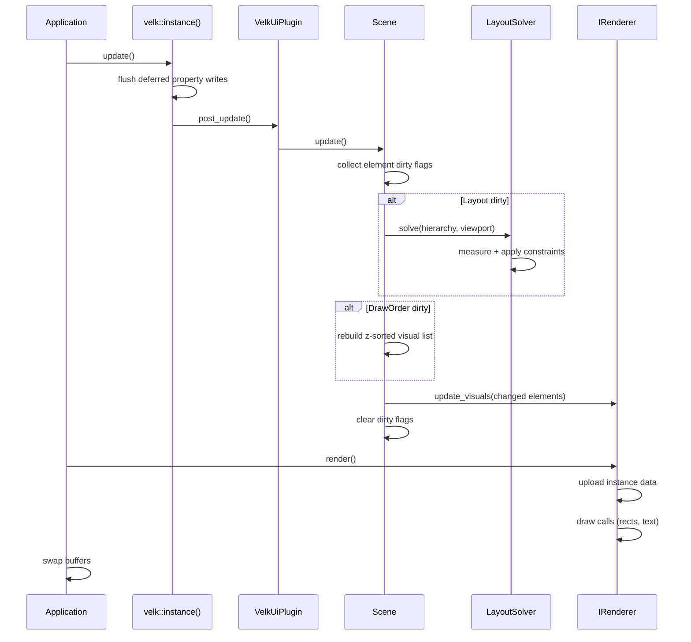

# Update cycle

velk-ui's frame loop is driven by `velk::instance().update()`, which triggers the scene's layout solver and renderer.

## Frame loop

A typical main loop:

```cpp
while (running) {
    glfwPollEvents();
    velk::instance().update();  // drives scene update via plugin post_update
    renderer->render();         // draws to screen
    glfwSwapBuffers(window);
}
```

## What happens during a frame



The velk-ui plugin hooks into velk's update cycle via `post_update()`. For each live scene, it calls `Scene::update()`, which processes dirty flags accumulated since the last frame.

### Dirty flags

Changes are tracked with `DirtyFlags`:

| Flag | Trigger | Effect |
|------|---------|--------|
| `Layout` | Element position/size changed, renderer viewport resized | Re-runs the layout solver |
| `Visual` | Visual property changed (color, text, etc.) | Pushes updated visuals to renderer |
| `DrawOrder` | Element z-index changed, hierarchy modified | Rebuilds the z-sorted visual list |

Flags accumulate between frames. A single `update()` processes all pending changes at once.

### Update steps

1. **Collect element dirty flags**: each element that was notified of a property change has its flags consumed and merged into the scene's dirty flags
2. **Layout solve** (if `Layout` is set): the solver walks the hierarchy top-down, calling `measure()` and `apply()` on each element's constraints. This writes final position and size into element state
3. **Rebuild draw list** (if `DrawOrder` is set): elements are collected in z-sorted order for rendering
4. **Push to renderer**: changed elements are sent to the renderer via `update_visuals()`
5. **Clear flags**: all dirty flags are reset for the next frame

### Viewport resize

The scene reads viewport dimensions from the renderer's `viewport_width` and `viewport_height` properties. When the renderer is set via `set_renderer()`, the scene subscribes to changes on these properties and automatically marks `Layout` as dirty when they change.

To handle window resize, just update the renderer:

```cpp
velk::write_state<velk_ui::IRenderer>(renderer, [&](velk_ui::IRenderer::State& s) {
    s.viewport_width = w;
    s.viewport_height = h;
});
glViewport(0, 0, w, h);
```

The scene will re-solve layout on the next `update()` automatically.

### Deferred updates

Property changes can be deferred via velk's `Deferred` flag. Deferred writes are batched and applied during `velk::instance().update()`, before the scene processes them. This is useful for bulk property changes that should trigger only one layout pass.
